  

## projects

<table>
  <tr>
    <td width="50%">
      <b><a href="https://github.com/dylanhoule/spotiwidget">Wavebar</a></b> 
      Open-source Spotify widget — connects through WebAPI, lives in the tray.
    </td>
    <td width="50%">
      <b><a href="https://dylanhoule.dev">dylanhoule.dev</a></b> 
      Portfolio & learning log, built with React + Tailwind.
    </td>
  </tr>
  <tr>
    <td width="50%">
      <b><a href="https://github.com/dylanhoule/workoutwidget-timer">workoutwidget-timer</a></b> 
      Workout timer widget, built in Swift.
    </td>
    <td width="50%">
      <b></b> 
      
    </td>
  </tr>
</table>

## stack

`typescript` `react` `tailwind` `sql` `swift` `node` `git` `java`

## stats

  
  

## learning

## contact

[dylanhoule.dev](https://dylanhoule.dev) · [linkedin.com/in/dylan-houle](https://linkedin.com/in/dylan-houle) · open to internships
